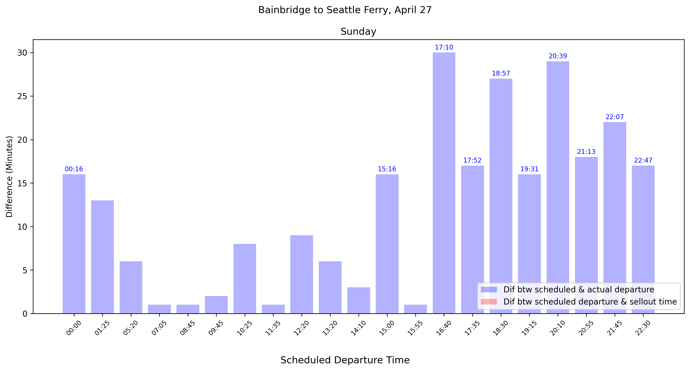

# Layman's Research Projects

### **Date added** May 2, 2025  
**Main ferry plots for the weekend**  
  

- Scraping code for sellout times: [here](src/ferry_scrape.py)
- Download code for departure times data frames: [here](src/ferry_data_download.py)
- Plotting code: [here](src/ferry_plot.py)

### **Date added** May 1, 2025  
**CNN Coverage: Percent of Headlines that contain "Trump"**  
  
Another news trend, this time longer-term out of curiousity. 
- Scraping and plotting code: [here](src/cnn_analysis.py)

### **Date added** April 30, 2025  
**Seattle to Bainbridge Ferry, April 26**  
  
I'm trying to plot the data from Washington State Ferries' sites and avoid weekend rush hours. 
- Scraping code for sellout times: [here](src/ferry_scrape.py)
- Download code for departure times data frames: [here](src/ferry_data_download.py)
- Plotting code: [here](src/ferry_plot.py)

### **Date added** April 22, 2025  
**CNN Coverage: Tariffs vs Signalgate**  
  
I'm interested in easy ways to track how long a news cycle lasts, and whether one competes with another. Google Trends for news will show a similar pattern, but I understand that's just for user searches rather than news coverage. Here, the counts for each topic are just based on the headline summaries for CNN transcipt data, rather than the full transcripts. Would love to learn about similar sites for other news orgs. 
- Code [here](src/cnn_analysis.py)

### **Date added** April 19, 2025  
**Average Gas vs Crude Oil Prices**  
Although the correlation is strong, the coloring here shows us that in later years the ratio of gas prices to oil prices is higher. This may also be due to some quality differences. 
  
- Code [here](src/oil_v_gas.py)

### **Date added** April 18, 2025  
**Number of Strikes and Lockouts in OECD Countries**  
I've always been struck by the decline since the 1970s of strikes across so many countries around the same time. 
  
- Code [here](src/strikes.py)

### **Date added** April 15, 2025  
**Washington State Map of DUI Filings by county and city.**  
Interested in what can be made with WA administrative data. 

- Code [here](src/dui_data.py)

### **Date added** April 4, 2025  
**Export to US as a share of GDP by country**
Southeast Asia was a suprise to me here. 

- Code [here](src/map_tariffs_impact.py)